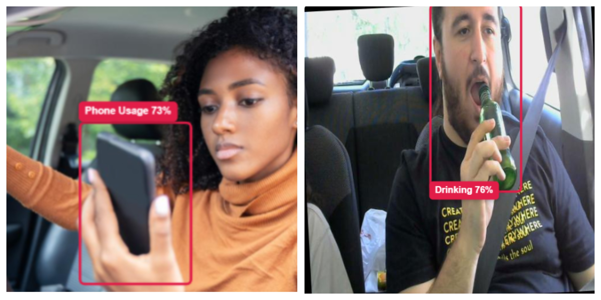
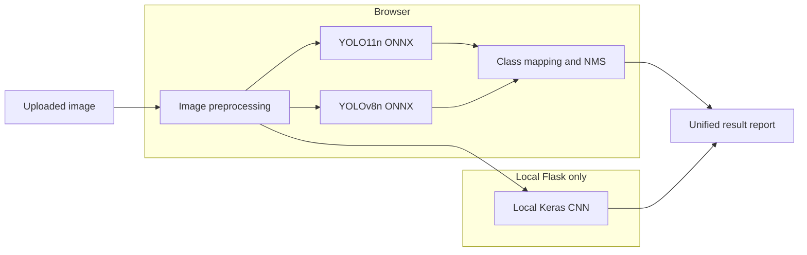

# Driver Monitoring System



[](https://driver-monitoring.vercel.app/)
[](https://www.python.org/)
[](https://flask.palletsprojects.com/)
[](https://docs.ultralytics.com/)

An academic computer vision project that compares two YOLO object detectors with a custom CNN classifier for driver-behavior analysis. The project includes trained weights, browser inference, local CNN inference, training notebooks, evaluation artifacts, demo images, and a complete web interface.

> [!IMPORTANT]
> This project is intended for college projects, AI/ML demonstrations, and learning. It is not a production driver-assistance system and must not be used for real road-safety decisions, surveillance, driver scoring, or vehicle control.

## Live Project

- Live browser demo: [driver-monitoring.vercel.app](https://driver-monitoring.vercel.app/)
- Technical documentation: [About the project](https://driver-monitoring.vercel.app/about.html)
- Source repository: [AlbatrossC/Driver-Monitoring-System](https://github.com/AlbatrossC/Driver-Monitoring-System)

The hosted Vercel deployment runs both YOLO models in the browser. Run the Flask application locally to enable the CNN as well.

## Main Features

- Upload one or multiple JPG/PNG driver images.
- Select ready-made demo images from the included gallery.
- Run YOLO11n and YOLOv8n through ONNX Runtime Web.
- Run the TensorFlow/Keras CNN through a local Flask API.
- Merge equivalent labels from independently trained YOLO models.
- Remove duplicate detections with confidence filtering and NMS.
- Display bounding boxes, confidence scores, model sources, and CNN output.
- Use separate static Vercel and full local execution modes.
- Review notebook-backed model classes, datasets, training settings, and metrics.

## Runtime Architecture



| Capability | Vercel | Local Flask |
|---|---:|---:|
| Web interface from `public/` | Yes | Yes |
| YOLO11 ONNX inference | Browser | Browser |
| YOLOv8 ONNX inference | Browser | Browser |
| CNN `.h5` inference | No | Yes |
| TensorFlow installation | Not required | Required |
| `/api/runtime-config` and `/api/cnn` | No | Yes |

Vercel is intentionally static. Its configuration sets `VERCEL=1`, serves `public/**`, and installs no Python packages. Locally, `app.py` serves the same frontend and lazily loads `models/mishra/driver_behavior_cnn.h5` when CNN inference is requested.

## Models and Results

### Detection metrics

The YOLO values below are from epoch 50 in the saved `results.csv` files. Metrics from different datasets and class sets should not be treated as a direct leaderboard comparison.

| Model | Classes | Precision | Recall | mAP50 | mAP50-95 | Runtime |
|---|---:|---:|---:|---:|---:|---|
| Soham YOLO11n | 8 | 0.9118 | 0.8343 | 0.9068 | 0.6592 | Browser and local |
| Chaitanya YOLOv8n | 5 | 0.8115 | 0.8441 | 0.8307 | 0.5617 | Browser and local |

### Soham YOLO11n

- Base model: `yolo11n.pt`
- Training: 50 epochs, batch 16, image size 640
- Optimizer: AdamW with cosine learning-rate scheduling
- Augmentation: mosaic 1.0, mixup 0.1, horizontal flip, translation, scale, and rotation
- Hardware target documented in the notebook: NVIDIA RTX 3050 Laptop GPU with 4 GB VRAM
- Training notebook: [`training_notebooks/1_soham_yolo11.ipynb`](training_notebooks/1_soham_yolo11.ipynb)
- Saved run: [`driver_monitor_sys/yolo11n_imbalance_fix/`](driver_monitor_sys/yolo11n_imbalance_fix/)

Classes:

| Index | Class | Meaning in the application |
|---:|---|---|
| 0 | `Distracted` | Attention appears directed away from normal driving |
| 1 | `Drinking` | Drinking action or beverage near the driver |
| 2 | `Drowsy` | Visual signs associated with reduced alertness |
| 3 | `Eating` | Food consumption activity |
| 4 | `PhoneUse` | Mapped to `Phone Usage` |
| 5 | `SafeDriving` | Normal-driving label; omitted from warning-box merging |
| 6 | `Seatbelt` | Visible seatbelt usage |
| 7 | `Smoking` | Smoking-related activity |

### Chaitanya YOLOv8n

- Base model: `yolov8n.pt`
- Saved training run: 50 epochs, batch 16, image size 640
- Optimizer: Ultralytics automatic optimizer selection
- Augmentation: mosaic 1.0, horizontal flip, translation, and scale
- Training notebook: [`training_notebooks/2_chaitanya_yolo8.ipynb`](training_notebooks/2_chaitanya_yolo8.ipynb)
- Saved run: [`driver_monitoring/yolov8_driver/`](driver_monitoring/yolov8_driver/)

Classes:

| Index | Class | Meaning in the application |
|---:|---|---|
| 0 | `Cigarette` | Mapped to `Smoking` |
| 1 | `Drinking` | Drinking activity |
| 2 | `Eating` | Eating activity |
| 3 | `Phone` | Mapped to `Phone Usage` |
| 4 | `Seatbelt` | Visible seatbelt usage |

### Divyanshu CNN

The local model is a Keras Sequential CNN with three Conv2D/MaxPooling stages, a 128-unit dense layer, dropout, and a five-class softmax output.

- Input: 128 x 128 RGB image
- Batch size: 32
- Configured training epochs: 15
- Optimizer: Adam
- Loss: sparse categorical cross-entropy
- Reported notebook accuracy: 0.9120
- Model file: [`models/mishra/driver_behavior_cnn.h5`](models/mishra/driver_behavior_cnn.h5)
- Training notebook: [`training_notebooks/3_divyanshu_cnn.ipynb`](training_notebooks/3_divyanshu_cnn.ipynb)

CNN classes:

1. `other_activities`
2. `safe_driving`
3. `talking_phone`
4. `texting_phone`
5. `turning`

The local API currently displays the first output index as `Smoking/Drinking/Yawning`. The notebook-trained label is `other_activities`, so this is an interface alias rather than a separately trained three-action class.

> [!NOTE]
> The saved CNN classification report contains non-zero test support only for `texting_phone` and `turning`. Its 91.2% overall result is therefore useful as a notebook result but does not prove balanced performance across all five classes.

## Datasets

| Dataset | Purpose | Classes | Split layout | License/source |
|---|---|---:|---|---|
| Driver Monitoring System v1 | Soham YOLO11 | 8 | `train`, `valid`, `test` | [Roboflow Universe](https://universe.roboflow.com/dataset-b2ns9/driver-monitoring-system-v0mei-mpvgx/dataset/1), CC BY 4.0 |
| Abnormal Driver Behaviour v1 | Chaitanya YOLOv8 | 5 | `train`, `valid`, `test` | [Roboflow Universe](https://universe.roboflow.com/computer-vision-ao07t/abnormal-driver-behaviour-bh1gs/dataset/1), CC BY 4.0 |
| Multi-Class Driver Behavior Image Dataset | Divyanshu CNN | 5 | Directory classes with 20% held out | [Kaggle](https://www.kaggle.com/datasets/arafatsahinafridi/multi-class-driver-behavior-image-dataset) |

The YOLO dataset definitions are stored in [`data/soham/data.yml`](data/soham/data.yml) and [`data/chaitanya/data.yml`](data/chaitanya/data.yml). The repository does not include the complete raw datasets; download them from their original sources before rerunning training.

## Image Processing and NMS

### Browser YOLO preprocessing

1. Create a 640 x 640 canvas with gray (`#808080`) padding.
2. Scale the image to fit while preserving its aspect ratio.
3. Center the resized image and save its scale and X/Y offsets.
4. Normalize RGB values from 0-255 to 0-1.
5. Create a float32 NCHW tensor with shape `[1, 3, 640, 640]`.
6. Convert predicted coordinates back to the original image using the saved scale and offsets.

### Local CNN preprocessing

1. Decode the uploaded Base64 image with Pillow.
2. Convert it to RGB.
3. Resize it to 128 x 128.
4. Normalize values to 0-1.
5. Add the batch dimension before model prediction.

### Detection merging

- Confidence threshold: `0.25`
- NMS IoU threshold: `0.45`
- `Cigarette` and `Smoking` are unified as `Smoking`.
- `Phone` and `PhoneUse` are unified as `Phone Usage`.
- Detections are grouped by unified class and sorted by confidence.
- Lower-confidence overlapping boxes are suppressed.
- The implementation also considers boxes overlapping when either box center lies inside the other box.
- Soham's `SafeDriving` output is excluded from the final warning-detection merge.

The implementation is in [`public/static/js/index.js`](public/static/js/index.js).

## Local Installation

### Prerequisites

- Python 3.10 or a TensorFlow-compatible Python version
- Git
- A modern browser with WebAssembly support
- Enough disk space and memory for TensorFlow, Ultralytics, and the model files

### Windows setup

```powershell
git clone https://github.com/AlbatrossC/Driver-Monitoring-System.git
cd Driver-Monitoring-System
python -m venv .venv
.\.venv\Scripts\Activate.ps1
python -m pip install --upgrade pip
pip install -r requirements.txt
python app.py
```

Open [http://127.0.0.1:5000](http://127.0.0.1:5000).

The two YOLO models load in the browser. The CNN is loaded by Flask on the first local CNN request, so the first analysis can take longer than later ones.

### Troubleshooting

| Problem | Check |
|---|---|
| CNN shows as unavailable | Start the site with `python app.py` from the repository root and use `127.0.0.1:5000` |
| CNN model file not found | Confirm `models/mishra/driver_behavior_cnn.h5` exists |
| YOLO models do not load | Confirm both `.onnx` files exist in `public/static/models/` |
| Browser opened as a local file | Do not open `public/index.html` directly when CNN support is required |
| TensorFlow installation fails | Use a Python version supported by the TensorFlow release installed on your platform |
| First prediction is slow | Model initialization and WebAssembly/TensorFlow warm-up occur on first use |

## Vercel Deployment

The repository is configured as a static Vercel deployment:

- Root directory: `./`
- Build command: none
- Output is served from: `public/`
- Python install command: skipped by `vercel.json`
- Environment behavior: `VERCEL=1`
- Models available: YOLO11 ONNX and YOLOv8 ONNX only

Import the repository into Vercel and deploy from the repository root. [`vercel.json`](vercel.json) contains the build and route configuration, while [`vercel-requirements.txt`](vercel-requirements.txt) documents that no Python packages are required by the static deployment.

## Project Structure

```text
Driver-Monitoring-System/
|-- app.py                         # Local Flask server and CNN API
|-- public/                        # Single frontend used locally and on Vercel
|   |-- index.html                 # Upload and model-selection interface
|   |-- results.html               # Analysis report
|   |-- about.html                 # Detailed technical documentation
|   |-- demo-images/               # Demo gallery used by the interface
|   `-- static/
|       |-- css/                   # Page styling
|       |-- js/                    # ONNX inference, NMS, results, analytics
|       `-- models/                # Browser-compatible YOLO ONNX models
|-- models/
|   |-- chaitanya/best.pt          # YOLOv8 PyTorch weights
|   |-- soham/best.pt              # YOLO11 PyTorch weights
|   `-- mishra/driver_behavior_cnn.h5
|-- training_notebooks/            # Three model-training notebooks
|-- testing_notebooks/             # YOLO11 and CNN test notebooks
|-- data/                           # YOLO dataset configuration files
|-- driver_monitoring/             # Saved YOLOv8 training artifacts
|-- driver_monitor_sys/            # Saved YOLO11 training artifacts
|-- resources/                     # Report, presentation, plan, and preview image
|-- requirements.txt               # Full local and training dependencies
|-- vercel-requirements.txt        # Static deployment dependency note
`-- vercel.json                    # Vercel static build and route configuration
```

The previous Flask template site is no longer used. `app.py` serves the same files from `public/` that are deployed to Vercel.

## Training and Evaluation

Training notebooks:

- [`1_soham_yolo11.ipynb`](training_notebooks/1_soham_yolo11.ipynb)
- [`2_chaitanya_yolo8.ipynb`](training_notebooks/2_chaitanya_yolo8.ipynb)
- [`3_divyanshu_cnn.ipynb`](training_notebooks/3_divyanshu_cnn.ipynb)

Testing notebooks:

- [`1_soham_yolo11_test.ipynb`](testing_notebooks/1_soham_yolo11_test.ipynb)
- [`3_divyanshu_cnn_testing.ipynb`](testing_notebooks/3_divyanshu_cnn_testing.ipynb)

To rerun training:

1. Download the appropriate dataset from its source.
2. Update the dataset path in the notebook or YAML configuration.
3. Install the full dependencies from `requirements.txt`.
4. Execute notebook cells in sequence.
5. Compare saved weights and validation artifacts before replacing production model files.
6. Export browser models to ONNX and place the final files in `public/static/models/`.

## Team and Contributions

Developed under the **Advanced Course on Green Skills and Artificial Intelligence** as part of the **Skills4Future Program**.

| Team member | Primary contribution |
|---|---|
| **Chaitanya Kulkarni** | YOLOv8 model training and dataset preparation |
| **Soham Jadhav** | YOLO11 model training and class-imbalance handling |
| **Divyanshu Mishra** | CNN model training and image classification |
| **Anurag Pawar** | Backend logic and server infrastructure |

- **Program:** Advanced Course on Green Skills and Artificial Intelligence
- **Organized by:** Edunet Foundation, AICTE, Shell India Markets Pvt. Ltd.
- **Mentor:** Professor Sarthak Narnor

## Academic Scope and Limitations

The project demonstrates a complete ML workflow, but its results are affected by dataset composition, class imbalance, lighting, camera position, occlusion, image resolution, and differences between training images and real environments. It analyzes uploaded still images and does not implement temporal tracking, gaze duration, vehicle telemetry, alert escalation, or production-grade fail-safe behavior.

Use the project for:

- College mini-projects and final-year demonstrations
- Computer vision and deep-learning coursework
- Comparing object detection with image classification
- Learning browser-side ONNX inference
- Explaining preprocessing, NMS, metrics, and deployment in a viva

Do not use it for real safety decisions or as a replacement for a validated driver-monitoring or ADAS product.

## Acknowledgments

Thanks to Edunet Foundation, AICTE, Shell India Markets Pvt. Ltd., Professor Sarthak Narnor, the dataset publishers, and the open-source projects used by this system, including Ultralytics, TensorFlow, Flask, ONNX Runtime, Pillow, and Roboflow.
